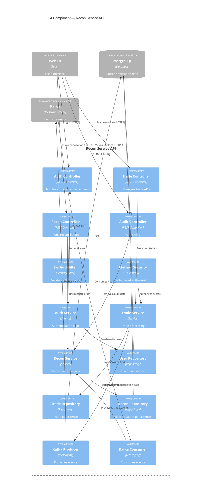

# C4 Component Diagram - Recon Service API

```mermaid
C4Component
title C4 Component — Recon Service API

Container_Ext(ui, "Web UI", "React", "User interface")
ContainerDb_Ext(postgres, "PostgreSQL", "Database", "Stores application data")
ContainerQueue_Ext(kafka, "Kafka", "Message Broker", "Event streaming")

Container_Boundary(api, "Recon Service API") {

    Component(authController, "Auth Controller", "REST Controller", "Handles authentication requests")
    Component(tradeController, "Trade Controller", "REST Controller", "Manages trade APIs")
    Component(reconController, "Recon Controller", "REST Controller", "Runs reconciliation")
    Component(auditController, "Audit Controller", "REST Controller", "Audit APIs")

    Component(jwtFilter, "JwtAuthFilter", "Security Filter", "Validates JWT tokens")
    Component(methodSecurity, "Method Security", "Security", "Role-based authorization")

    Component(authService, "Auth Service", "Service", "Authentication logic")
    Component(tradeService, "Trade Service", "Service", "Trade processing")
    Component(reconService, "Recon Service", "Service", "Reconciliation engine")

    Component(userRepository, "User Repository", "Repository", "User persistence")
    Component(tradeRepository, "Trade Repository", "Repository", "Trade persistence")
    Component(reconRepository, "Recon Repository", "Repository", "Reconciliation persistence")

    Component(kafkaProducer, "Kafka Producer", "Messaging", "Publishes events")
    Component(kafkaConsumer, "Kafka Consumer", "Messaging", "Consumes events")
}

Rel(ui, authController, "Login (HTTPS)")
Rel(ui, tradeController, "Manage trades (HTTPS)")
Rel(ui, reconController, "Run reconciliation (HTTPS)")
Rel(ui, auditController, "View audit logs (HTTPS)")

Rel(authController, authService, "Authenticates")
Rel(tradeController, tradeService, "Processes trades")
Rel(reconController, reconService, "Runs reconciliation")
Rel(auditController, reconService, "Retrieves audit data")

Rel(jwtFilter, authController, "Validates JWT")
Rel(methodSecurity, tradeService, "Authorizes access")

Rel(authService, userRepository, "Reads/Writes users")
Rel(tradeService, tradeRepository, "Reads/Writes trades")
Rel(reconService, reconRepository, "Reads/Writes reconciliation data")

Rel(userRepository, postgres, "SQL")
Rel(tradeRepository, postgres, "SQL")
Rel(reconRepository, postgres, "SQL")

Rel(tradeService, kafkaProducer, "Publishes events")
Rel(kafkaProducer, kafka, "Publishes / Kafka")
Rel(kafka, kafkaConsumer, "Consumes / Kafka")
Rel(kafkaConsumer, reconService, "Processes trade events")
```