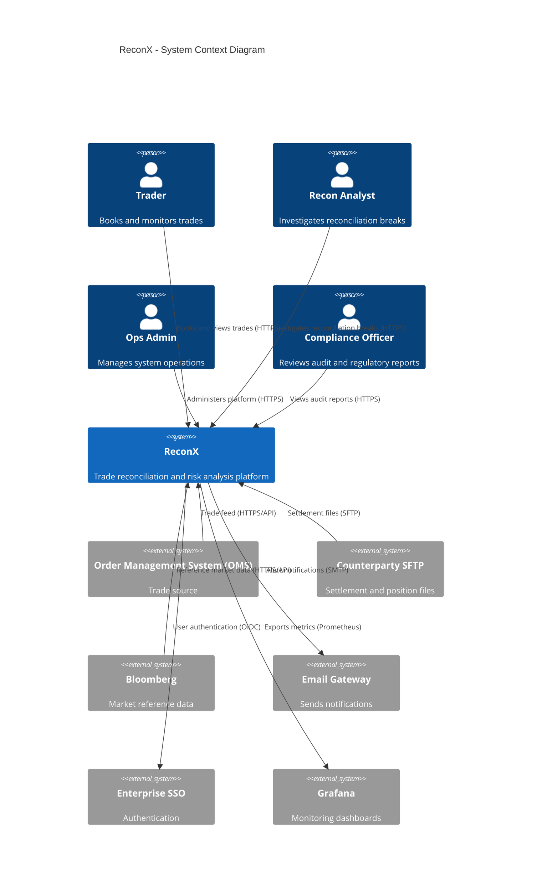

# ReconX - C4 Level 1 Context Diagram

```mermaid
C4Context
title ReconX - System Context Diagram

Person(trader, "Trader", "Books and monitors trades")
Person(analyst, "Recon Analyst", "Investigates reconciliation breaks")
Person(admin, "Ops Admin", "Manages system operations")
Person(compliance, "Compliance Officer", "Reviews audit and regulatory reports")

System(reconx, "ReconX", "Trade reconciliation and risk analysis platform")

System_Ext(oms, "Order Management System (OMS)", "Trade source")
System_Ext(sftp, "Counterparty SFTP", "Settlement and position files")
System_Ext(bloomberg, "Bloomberg", "Market reference data")
System_Ext(email, "Email Gateway", "Sends notifications")
System_Ext(sso, "Enterprise SSO", "Authentication")
System_Ext(grafana, "Grafana", "Monitoring dashboards")

Rel(trader, reconx, "Books and views trades (HTTPS)")
Rel(analyst, reconx, "Investigates reconciliation breaks (HTTPS)")
Rel(admin, reconx, "Administers platform (HTTPS)")
Rel(compliance, reconx, "Views audit reports (HTTPS)")

Rel(oms, reconx, "Trade feed (HTTPS/API)")
Rel(sftp, reconx, "Settlement files (SFTP)")
Rel(bloomberg, reconx, "Reference market data (HTTPS/API)")
Rel(reconx, email, "Alert notifications (SMTP)")
Rel(reconx, sso, "User authentication (OIDC)")
Rel(reconx, grafana, "Exports metrics (Prometheus)")
```