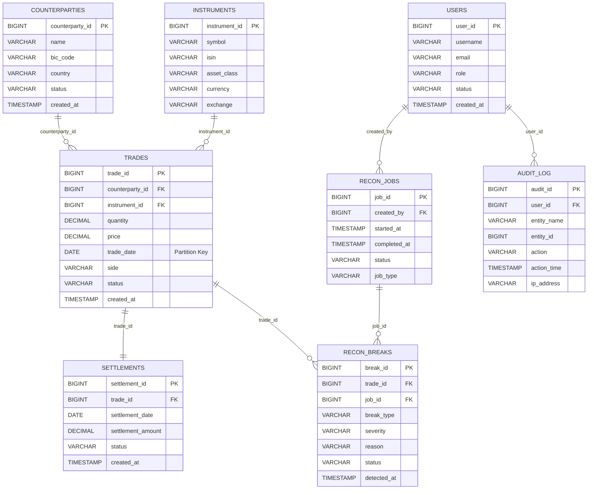

```mermaid
erDiagram

    COUNTERPARTIES {
        BIGINT counterparty_id PK
        VARCHAR name
        VARCHAR bic_code
        VARCHAR country
        VARCHAR status
        TIMESTAMP created_at
    }

    INSTRUMENTS {
        BIGINT instrument_id PK
        VARCHAR symbol
        VARCHAR isin
        VARCHAR asset_class
        VARCHAR currency
        VARCHAR exchange
    }

    USERS {
        BIGINT user_id PK
        VARCHAR username
        VARCHAR email
        VARCHAR role
        VARCHAR status
        TIMESTAMP created_at
    }

    TRADES {
        BIGINT trade_id PK
        BIGINT counterparty_id FK
        BIGINT instrument_id FK
        DECIMAL quantity
        DECIMAL price
        DATE trade_date "Partition Key"
        VARCHAR side
        VARCHAR status
        TIMESTAMP created_at
    }

    SETTLEMENTS {
        BIGINT settlement_id PK
        BIGINT trade_id FK
        DATE settlement_date
        DECIMAL settlement_amount
        VARCHAR status
        TIMESTAMP created_at
    }

    RECON_JOBS {
        BIGINT job_id PK
        BIGINT created_by FK
        TIMESTAMP started_at
        TIMESTAMP completed_at
        VARCHAR status
        VARCHAR job_type
    }

    RECON_BREAKS {
        BIGINT break_id PK
        BIGINT trade_id FK
        BIGINT job_id FK
        VARCHAR break_type
        VARCHAR severity
        VARCHAR reason
        VARCHAR status
        TIMESTAMP detected_at
    }

    AUDIT_LOG {
        BIGINT audit_id PK
        BIGINT user_id FK
        VARCHAR entity_name
        BIGINT entity_id
        VARCHAR action
        TIMESTAMP action_time
        VARCHAR ip_address
    }

   COUNTERPARTIES ||--o{ TRADES : "counterparty_id"

    INSTRUMENTS ||--o{ TRADES : "instrument_id"

    TRADES ||--|| SETTLEMENTS : "trade_id"

    USERS ||--o{ RECON_JOBS : "created_by"

    RECON_JOBS ||--o{ RECON_BREAKS : "job_id"

    TRADES ||--o{ RECON_BREAKS : "trade_id"

    USERS ||--o{ AUDIT_LOG : "user_id"
```
